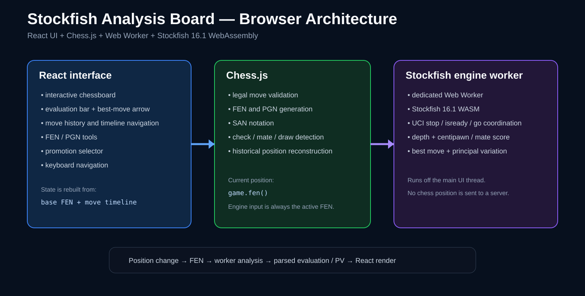

# Stockfish Analysis Board

[](https://github.com/Lucaapaglia/chessapp/actions/workflows/ci.yml)

A browser-based chess analysis application built with React, Chess.js, react-chessboard, and Stockfish 16.1 running locally through a Web Worker and WebAssembly.

**Live demo:** https://lucaapaglia.github.io/chessapp/

## Why this project

The goal is not to reproduce a full chess platform. The project focuses on the technically interesting parts of a local analysis tool:

- keeping React state synchronized with a legal chess position
- running a CPU-heavy chess engine without blocking the UI
- coordinating asynchronous UCI engine commands safely
- parsing engine evaluation, best move, depth, and principal variation
- navigating historical positions while continuously re-analyzing the active board

## Features

- legal move validation with Chess.js
- Stockfish 16.1 analysis in a Web Worker
- Stockfish WebAssembly execution entirely in the browser
- evaluation normalized from White's perspective
- visual evaluation bar
- best-move arrow and principal variation
- last-move highlighting
- SAN move history
- clickable move navigation
- keyboard history navigation
- New Game, Undo, Redo, and Flip Board controls
- queen / rook / bishop / knight promotion selector
- load custom FEN positions
- copy current FEN
- copy current PGN
- check, checkmate, stalemate, repetition, and draw status
- responsive desktop/mobile layout
- GitHub Actions test and production-build validation
- GitHub Pages deployment

No chess position is sent to a backend.

## Architecture



```text
React UI
  │
  ├── Chess.js
  │    ├── legal move validation
  │    ├── FEN / PGN / SAN
  │    └── game-state detection
  │
  └── useStockfish
       └── Web Worker
            └── Stockfish 16.1 WASM
```

The application stores a base FEN plus a move timeline. Historical positions are reconstructed with Chess.js rather than storing mutable game objects in React state.

For engine analysis, the `useStockfish` hook coordinates:

```text
stop → isready → position fen ... → go depth 16
```

This prevents stale engine output from an older position from replacing analysis for the current board.

## Move navigation

The move list is interactive. Clicking any SAN move rebuilds that historical position and Stockfish immediately analyzes it.

Keyboard shortcuts:

| Key | Action |
|---|---|
| `←` | previous position |
| `→` | next position |
| `Home` | starting position |
| `End` | latest position |

Making a new move from an earlier position discards the previous future line, matching standard analysis-board behavior.

## Position tools

The board supports custom FEN input.

Example promotion test position:

```text
7k/P7/8/8/8/8/8/7K w - - 0 1
```

Move `a7 → a8` to open the promotion selector.

The current FEN and PGN can also be copied directly from the interface.

## Testing

The project includes automated tests for the chess-state utilities, including:

- rebuilding a position from stored moves
- UCI move parsing and SAN conversion
- principal-variation conversion
- promotion detection
- move timeline splitting
- checkmate status

GitHub Actions runs on pushes and pull requests:

```bash
npm ci --legacy-peer-deps
npm test -- --watchAll=false
npm run build
```

## Run locally

Requirements:

- Node.js 20+
- npm
- modern browser with Web Worker and WebAssembly support

```bash
git clone https://github.com/Lucaapaglia/chessapp.git
cd chessapp
npm install --legacy-peer-deps
npm start
```

Then open:

```text
http://localhost:3000
```

## Project structure

```text
src/
├── components/
│   ├── AnalysisPanel.js
│   ├── EvaluationBar.js
│   ├── GameControls.js
│   ├── MoveHistory.js
│   ├── PositionTools.js
│   └── PromotionDialog.js
├── hooks/
│   └── useStockfish.js
├── utils/
│   ├── chess.js
│   └── chess.test.js
├── App.js
└── App.css

public/js/
├── stockfish-16.1-lite-single.js
└── stockfish-16.1-lite-single.wasm
```

## Skills demonstrated

- React state management
- component-based UI design
- JavaScript modules
- Web Workers
- WebAssembly integration
- asynchronous event handling
- UCI protocol integration
- immutable timeline/state reconstruction
- responsive CSS
- unit testing
- GitHub Actions CI/CD
- static web deployment

## Portfolio summary

> Built a browser-based chess analysis application using React and Chess.js, integrating Stockfish 16.1 WebAssembly through a Web Worker for non-blocking engine analysis. Implemented UCI synchronization, evaluation and principal-variation parsing, interactive move-history navigation, FEN/PGN tooling, promotion handling, automated tests, and CI/CD deployment.
